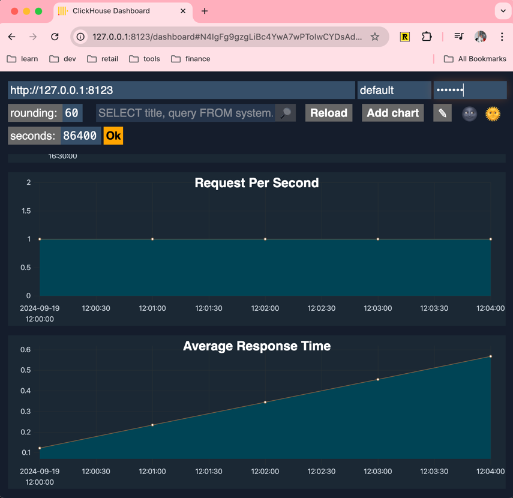

### Метрики и мониторинг. Логирование 


# Придумать 2 или более запросов для персонализированного мониторинга.
```sql
-- Запросы в секунду по нашим "кастомным логам"
SELECT 
    toStartOfInterval(event_time, INTERVAL {rounding:UInt32} SECOND)::INT AS t, 
    count(*) AS requests_per_second
FROM 
    web_server_logs
WHERE 
    event_time >= now() - INTERVAL {seconds:UInt32} SECOND
GROUP BY 
    t
ORDER BY 
    t WITH FILL STEP {rounding:UInt32};
    
-- Средняя время ответа, тоже по нашим логам
SELECT 
    toStartOfInterval(event_time, INTERVAL {rounding:UInt32} SECOND)::INT AS t, 
    avg(response_time) AS avg_response_time
FROM 
    web_server_logs
WHERE 
    event_time >= now() - INTERVAL {seconds:UInt32} SECOND
GROUP BY 
    t
ORDER BY 
    t WITH FILL STEP {rounding:UInt32};
```
# Создать таблицу с этими запросами в нужном формате
```sql
-- Наши логи какого-то web приложения
CREATE TABLE web_server_logs (
    event_time DateTime,
    request_method String,
    status_code UInt16,
    response_time Float32,
    bytes_sent UInt64
) ENGINE = MergeTree()
PARTITION BY toYYYYMM(event_time)
ORDER BY (event_time, status_code);

-- Синтетические данные
INSERT INTO web_server_logs (event_time, request_method, status_code, response_time, bytes_sent) VALUES
('2024-09-19 12:00:00', 'GET', 200, 0.123, 1024),
('2024-09-19 12:01:00', 'POST', 201, 0.234, 2048),
('2024-09-19 12:02:00', 'GET', 404, 0.345, 512),
('2024-09-19 12:03:00', 'GET', 200, 0.456, 1024),
('2024-09-19 12:04:00', 'POST', 500, 0.567, 0);
```
# Предоставить скриншот встроенного дашборда, показывающего эти таблицы

