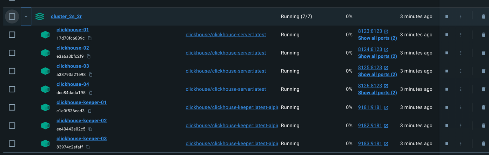
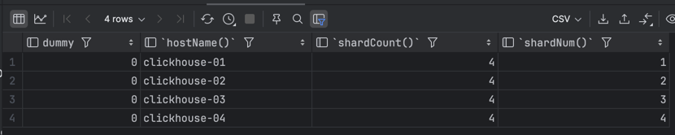
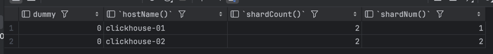
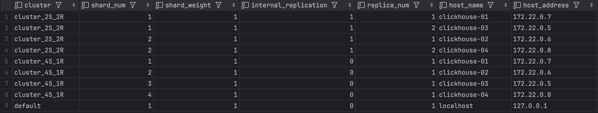

### Домашнее задание 10
#### Шардировать свой инстанс


**1) Запустить N экземпляров clickhouse-server**:

Использовал вот этот [docker-compose.yaml](cluster_2S_2R/docker-compose.yaml).



**2,3)  Описать несколько (2 или более) топологий объединения экземпляров в шарды в конфигурации clickhouse на одном из экземпляров. Предоставить xml-секцию для проверки текстовым файлом**


Всю конфигурацию можно посмотреть вот тут - [config.xml](cluster_2S_2R/fs/volumes/clickhouse-04/etc/clickhouse-server/config.d/config.xml)    
Отдельная секция с топологиями

```yaml
<remote_servers>
        <cluster_2S_2R>
            <shard>
                <internal_replication>true</internal_replication>
                <replica>
                    <host>clickhouse-01</host>
                    <port>9000</port>
                </replica>
                <replica>
                    <host>clickhouse-03</host>
                    <port>9000</port>
                </replica>
            </shard>
            <shard>
                <internal_replication>true</internal_replication>
                <replica>
                    <host>clickhouse-02</host>
                    <port>9000</port>
                </replica>
                <replica>
                    <host>clickhouse-04</host>
                    <port>9000</port>
                </replica>
            </shard>
        </cluster_2S_2R>
        <cluster_4S_1R>
            <shard>
                <replica>
                    <host>clickhouse-01</host>
                    <port>9000</port>
                </replica>
            </shard>
            <shard>
                <replica>
                    <host>clickhouse-02</host>
                    <port>9000</port>
                </replica>
            </shard>
            <shard>
                <replica>
                    <host>clickhouse-03</host>
                    <port>9000</port>
                </replica>
            </shard>
            <shard>
                <replica>
                    <host>clickhouse-04</host>
                    <port>9000</port>
                </replica>
            </shard>
        </cluster_4S_1R>
    </remote_servers>
```

**4) Создать DISTRIBUTED-таблицу на каждую из топологий и посмотреть на характеристики получившихся таблиц**


```sql
-- Создадим базу данных на всех нодах
CREATE DATABASE evv ON CLUSTER 'cluster_4S_1R';

-- Создаем распределенную табличку на четырех щардах с одной репликой
CREATE TABLE evv.distributed_dummy_4s_1r ENGINE = Distributed(
    cluster_4S_1R, system, one, rand()
)

-- Создаем распределенную табличку на двух шардах с двумя репликами
CREATE TABLE evv.distributed_dummy_2s_2r ENGINE = Distributed(
    cluster_2S_2R, system, one, rand()
)
```


```sql
-- Смотрим характеристики таблички в первой топологии
SELECT *,hostName(), shardCount(), shardNum() FROM evv.distributed_dummy_4s_1r;
```


```sql
-- Проверяем табличку на второй топологии
SELECT *,hostName(), shardCount(), shardNum() FROM evv.distributed_dummy_2s_2r;
```



```sql
SELECT * FROM system.clusters;
```

