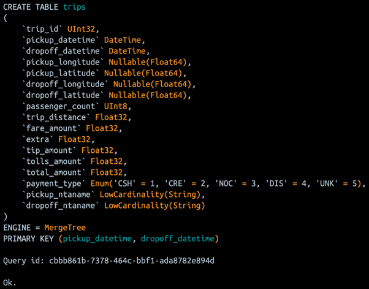
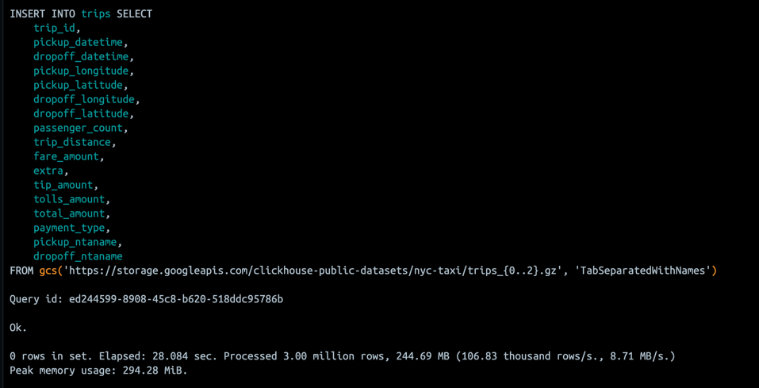
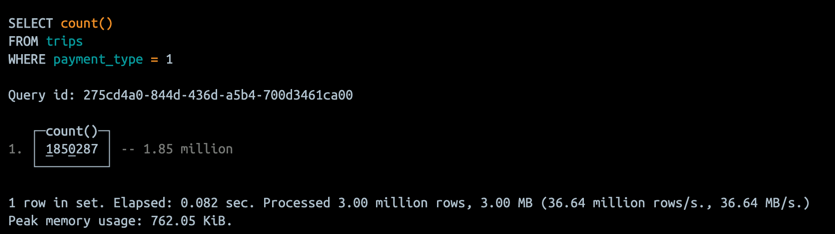

## Домашнее задание #2
### Установка и первоначальная настройка Clickhouse

### 1. Установить clickhouse
Есть разные варианты установки, с которыми можно ознакомиться в [документации](https://clickhouse.com/docs/en/install#quick-install).    
Я выбрал использование https://hub.docker.com/r/clickhouse/clickhouse-server/.


### 2, 3. Подгрузить датасет для примера и сделать селект из таблицы. Для проверки отправить скрины работающего инстанса ClickHouse, созданной виртуальной машины и результата запроса select count() from trips where payment_type = 1

Скриншот запущенного инстанса из [docker-compose.yaml](docker-compose.yaml):


Подгрузка датасета из примера:   
https://clickhouse.com/docs/en/getting-started/example-datasets/nyc-taxi    


1. Создание таблички `trips`




2. Вставляем туда данные, используем не все файлы - `{0...2}.gz`. 





3. Прогоняем запрос:
```sql
SELECT COUNT() FROM trips WHERE payment_type=1
```    





### 4. Провести тестирование производительности и сохранить результаты;

Используемая команда для тестирования:
```bash
echo "SELECT * FROM default.trips LIMIT 10000000 OFFSET 10000000" | clickhouse-benchmark -i 100
```

Результаты тестирования:
```bash
# 

# Количество выполненных запросов - всего 100
Queries executed: 100.

# QPS - Queries Per Second, в среднем  7.689 запросов выполнялось за одну секунду
# RPS - Rows Per Second, число строк обрабатоваемых за одну секунду
# MIB/S - Mib per Second, объем данных, который обрабатывается за одну секунду.
localhost:9000, queries: 100, QPS: 7.689, RPS: 23069372.858, MiB/s: 1598.501, result RPS: 0.000, result MiB/s: 0.000.


# Задержки выполнения запросов в процентилях
# Минимальное время выполнения запроса — 0.083 секунды.
0.000%          0.083 sec.
10.000%         0.087 sec.
20.000%         0.091 sec.
30.000%         0.095 sec.
40.000%         0.099 sec.
50.000%         0.112 sec.
60.000%         0.117 sec.
70.000%         0.131 sec.
80.000%         0.147 sec.
90.000%         0.176 sec.
95.000%         0.228 sec.
# 99% запросов были выполнены за 0.388 секунды или быстрее.
99.000%         0.388 sec.
99.900%         0.498 sec.
99.990%         0.498 sec.
```

### 5. Изучить конфигурационные файлы БД
Множество параметров конфигураций можно найти вот тут:
https://clickhouse.com/docs/en/operations/settings/settings

### 6,7.Произвести наиболее оптимальную настройку системы на основании характеристик вашей ОС и провести повторное тестирование. Подготовить отчет касательно прироста/изменения производительности системы на основе проведенных настроек.

Потюнил некоторые параметры в файле [tuning.xml](clickhouse%2Fconfig%2Ftuning.xml)
```yaml
<clickhouse>
   # Вообще тут вроде дефолтно `the number of physical CPU cores.`, но я уточнил 
    <max_threads>10</max_threads>
    # На всякий случай уточним
    <max_memory_usage>10</max_memory_usage>
    # Тут тоже  чтобы было
    <max_concurrent_queries>20</max_concurrent_queries>
    # Накидываем  ограничение на время исполнения запросов, а то один раз я испугался
    <max_execution_time>60</max_execution_time>
    # Увеличиваем кэш с метаданнными о блоках
    <mark_cache_size>5368709120</mark_cache_size> <!-- 5GB -->

    <merge_tree>
        # Ограничиваем нагрузку на моменте слияния, скорее просто поигрался
        <max_saving_ranges_to_merge_at_once>100</max_saving_ranges_to_merge_at_once>
        # Количество байт которые могут быть смержены за раз, борем за производительность мерджа ( возможно не стоит )
        <max_bytes_to_merge_at_max_space_in_pool>104857600000</max_bytes_to_merge_at_max_space_in_pool> <!-- 100GB -->
    </merge_tree>
      
    # lz4 модно и молодежно, возможно снижает disk I/O и улучше read/write производительность
    <compression>
        <method>lz4</method>
    </compression>
    
    # Возможно могло помочь, так как меньше данных передается по сети, но это не точно, так как время тратиться потом на расжатие этих данных
    <network_compression_method>lz4</network_compression_method>
</clickhouse>

```


В итоге получили новый benchmark:
```bash
Queries executed: 100.

localhost:9000, queries: 100, QPS: 10.112, RPS: 30340106.731, MiB/s: 2102.298, result RPS: 0.000, result MiB/s: 0.000.

0.000%          0.079 sec.
10.000%         0.083 sec.
20.000%         0.084 sec.
30.000%         0.085 sec.
40.000%         0.087 sec.
50.000%         0.088 sec.
60.000%         0.090 sec.
70.000%         0.095 sec.
80.000%         0.101 sec.
90.000%         0.110 sec.
95.000%         0.122 sec.
99.000%         0.155 sec.
99.900%         0.473 sec.
99.990%         0.473 sec.
```

Если верить бенчмарку то увеличился QPS, RPS,Mib/S и перцентили смотрятся лучше.    
Вряд ли результат можно назвать статзначимым, так как сложно гарантировать одинаковые условия нагрузочного тестирования на локальной машинке, да еще и в докере, ну и надо прогонять явно не один раз.   
Возможно улучшение связано не с новыми настройками клика, а с освободившемися ресурсами у меня на ноутбуке =)

Если подходить серьезно, то бенчмарк надо менять ( использовать не только SELECT в одну таблицу), осознанно варить клик прямо на железке ( не в докере ) и можно попробовать еще вот такое:
https://clickhouse.com/docs/en/operations/utilities/clickhouse-benchmark#clickhouse-benchmark-comparison-mode


