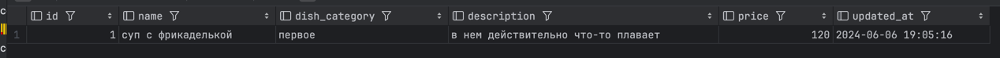

## Домашнее задание #3
## Работа с SQL в ClickHouse

Цель:
Отработать основные sql-операции
Изучить на практике особенности sql-диалекта

Описание/Пошаговая инструкция выполнения домашнего задания:
Последовательность шагов для выполнения ДЗ:

### 1.Создать новую базу данных и перейти в нее.

```clickhouse
-- Создаем новую схему
CREATE DATABASE IF NOT EXISTS sales_database;

-- Увереннно используем ее
USE sales_database;
```

### 2.Создать таблицу для бизнес-кейса "Меню ресторана" с 5+ полями, наполнить ее данными. Обязательно указывать, где нужно, модификаторы Nullable, LowCardinality и пр. Добавить комментарии.
```clickhouse
CREATE TABLE restaraunt_menu (
--     ID записи, лишним не будет
    id UInt8,
--     Пусть тут будет первое, второе и компот, делаем биг дату для школьной столовой
    dish_category LowCardinality(String),
--     Некоторый повара немногословны
    description Nullable(String),
--     Такое поле лишним не бывает
    updated_at DateTime DEFAULT now(),
--     Есть почти у всего...
    price Float32
) ENGINE = MergeTree() ORDER BY (updated_at)
```


### 3.Протестировать CRUD на созданной таблице.
```sql
INSERT INTO restaraunt_menu VALUES (1, 'суп с фрикадельками', 'первое', 'в нем действительно что-то плавает', 120.0, DEFAULT);
INSERT INTO restaraunt_menu VALUES (2, 'гуляш', 'второй', NULL, 120.0, DEFAULT);
```

```sql
SELECT * FROM restaraunt_menu;
```


```clickhouse
ALTER TABLE restaraunt_menu UPDATE name = 'суп с фрикаделькой' IN PARTITION 'первое' WHERE id = 1;
```


```clickhouse
ALTER TABLE restaraunt_menu DELETE WHERE id = 2;
```


### 4.Добавить несколько новых полей, удалить пару старых.
```clickhouse

-- First без особого смысла, просто чтобы запомнить, что так можно
ALTER TABLE restaraunt_menu ADD COLUMN composition String FIRST;

ALTER TABLE restaraunt_menu DROP COLUMN description;

SELECT * FROM restaraunt_menu;
```
 

### 5.Заселектить таблицу (любую) из sample dataset - https://clickhouse.com/docs/en/getting-started/example-datasets/menus.
```sql
SELECT * FROM file('/var/lib/clickhouse/user_files/Menu.csv', CSV);
```


### 6.Материализовать таблицу из п.5 (в виде таблицы)
Не очень понял, что такое "материализовать таблицу в виде таблицы", возникает ассоциация `MATERIALIZED`, но там вроде либо `VIEW` либо `COLUMN`.   
Наверно подразумевается что-то такое, могу ошибаться.
```clickhouse
CREATE TABLE menu
(
    id UInt32,
    name String,
    sponsor String,
    event String,
    venue String,
    place String,
    physical_description String,
    occasion String,
    notes String,
    call_number String,
    keywords String,
    language String,
    date String,
    location String,
    location_type String,
    currency String,
    currency_symbol String,
    status String,
    page_count UInt16,
    dish_count UInt16
) ENGINE = MergeTree ORDER BY id;


INSERT INTO menu SELECT * FROM file('/var/lib/clickhouse/user_files/Menu.csv', CSV);
SELECT * FROM menu;

```
### 7.Поработать с партами. Сделать attach/detach/drop. Добавить данных в первоначально созданную таблицу.
```clickhouse
INSERT INTO restaraunt_menu VALUES ('', 3, 'пюре', 'второе', 120.0, DEFAULT);
INSERT INTO restaraunt_menu VALUES ('', 4, 'греча', 'второе', 120.0, DEFAULT);
INSERT INTO restaraunt_menu VALUES ('', 5, 'рис', 'второе', 120.0, DEFAULT);
SELECT * FROM restaraunt_menu;
```


```clickhouse
-- Делаем DETACH, партиция уходит в /detached
ALTER TABLE restaraunt_menu DETACH PARTITION 'первое';

SELECT * FROM restaraunt_menu;
```


```clickhouse
SELECT partition, active FROM system.parts WHERE table='restaraunt_menu';
```


```clickhouse
-- Возвращаем обратно
ALTER TABLE restaraunt_menu ATTACH PARTITION 'первое';

SELECT * FROM restaraunt_menu;
```


```sql
SELECT partition, active, removal_state FROM system.parts WHERE table='restaraunt_menu';
```


```clickhouse
-- Из документации, в отличие от detach:
--     Deletes the specified partition from the table. 
--     This query tags the partition as inactive and deletes data completely,
--     approximately in 10 minutes.


ALTER TABLE restaraunt_menu DROP PARTITION 'первое';
SELECT * FROM restaraunt_menu;
```


