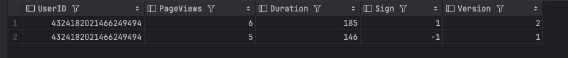
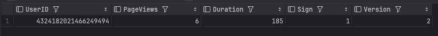
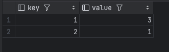
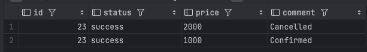
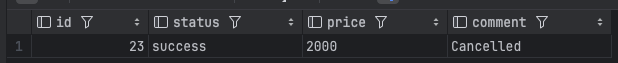
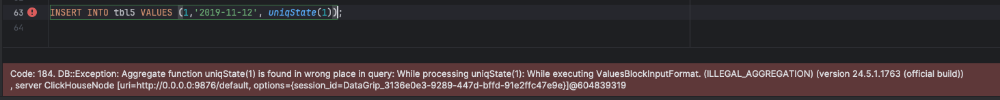
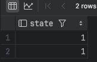
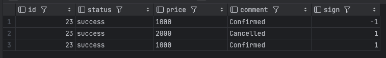
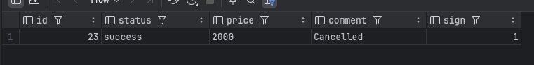

## Условия ДЗ: 
По заданным описаниям таблиц и вставки данных определить используемый движок   
Заполнить пропуски, запустить код   
Сравнить полученный вывод и результат из условия. 

----

```sql
CREATE TABLE tbl1
(
    UserID UInt64,
    PageViews UInt8,
    Duration UInt8,
    Sign Int8,
    Version UInt8
)
ENGINE = CollapsingMergeTree(Sign)
ORDER BY UserID;

INSERT INTO tbl1 VALUES (4324182021466249494, 5, 146, -1, 1);
INSERT INTO tbl1 VALUES (4324182021466249494, 5, 146, 1, 1),(4324182021466249494, 6, 185, 1, 2);
```

```sql
SELECT * FROM tbl1;
```


```sql
SELECT * FROM tbl1 final;
```



**Выбранный движок:** CollapsingMergeTree(Sign)    
**Почему**: Увидел модификатор `FINAL` и понял, что нужно схлопывать записи ( + на вебинаре разбирали пример с `Sign`)


---

```sql
CREATE TABLE tbl2
(
    key UInt32,
    value UInt32
)
ENGINE = SummingMergeTree
ORDER BY key;

INSERT INTO tbl2 Values(1,1),(1,2),(2,1);
```

```sql
select * from tbl2;
```


**Выбранный движок:** SummingMergeTree   
**Почему**: Выглядит как key-value хранилище, прикольно можно просуммировать значение по ключу, типа аккумуляторы!


---
```sql

CREATE TABLE tbl3
(
    `id` Int32,
    `status` String,
    `price` String,
    `comment` String
)
ENGINE = ReplacingMergeTree
PRIMARY KEY (id)
ORDER BY (id, status);

INSERT INTO tbl3 VALUES (23, 'success', '1000', 'Confirmed');
INSERT INTO tbl3 VALUES (23, 'success', '2000', 'Cancelled'); 

SELECT * from tbl3 WHERE id=23;
```


```sql
SELECT * from tbl3 FINAL WHERE id=23;
```


**Выбранный движок:** ReplacingMergeTree    
**Почему**: Можем сохранять последний актуальный `comment` благодаря `ReplacingMergeTree`


---

```sql
CREATE TABLE tbl4
(   CounterID UInt8,
    StartDate Date,
    UserID UInt64
) ENGINE = MergeTree
PARTITION BY toYYYYMM(StartDate) 
ORDER BY (CounterID, StartDate);

INSERT INTO tbl4 VALUES(0, '2019-11-11', 1);
INSERT INTO tbl4 VALUES(1, '2019-11-12', 1);
```

**Выбранный движок:** MergeTree    
**Почему**: Увидел партиции, вроде `MergeTree` нормально зайдет   


---
```sql
CREATE TABLE tbl5
(   CounterID UInt8,
    StartDate Date,
    UserID AggregateFunction(uniq, UInt64)
) ENGINE = AggregatingMergeTree
PARTITION BY toYYYYMM(StartDate) 
ORDER BY (CounterID, StartDate);

INSERT INTO tbl5
select CounterID, StartDate, uniqState(UserID)
from tbl4
group by CounterID, StartDate;
```

```sql
INSERT INTO tbl5 VALUES (1,'2019-11-12',1);
```


```sql
SELECT uniqMerge(UserID) AS state 
FROM tbl5 
GROUP BY CounterID, StartDate;
```


**Выбранный движок:** AggregatingMergeTree   
**Почему**:  Агрегирующие функции мелькнули

---

```sql
CREATE TABLE tbl6
(
    `id` Int32,
    `status` String,
    `price` String,
    `comment` String,
    `sign` Int8
)
ENGINE = CollapsingMergeTree(sign)
PRIMARY KEY (id)
ORDER BY (id, status);

INSERT INTO tbl6 VALUES (23, 'success', '1000', 'Confirmed', 1);
INSERT INTO tbl6 VALUES (23, 'success', '1000', 'Confirmed', -1), (23, 'success', '2000', 'Cancelled', 1);

SELECT * FROM tbl6;
```



```sql
SELECT * FROM tbl6 FINAL;
```


**Выбранный движок:** CollapsingMergeTree(sign)  
**Почему**:  Sign и FINAL

---

