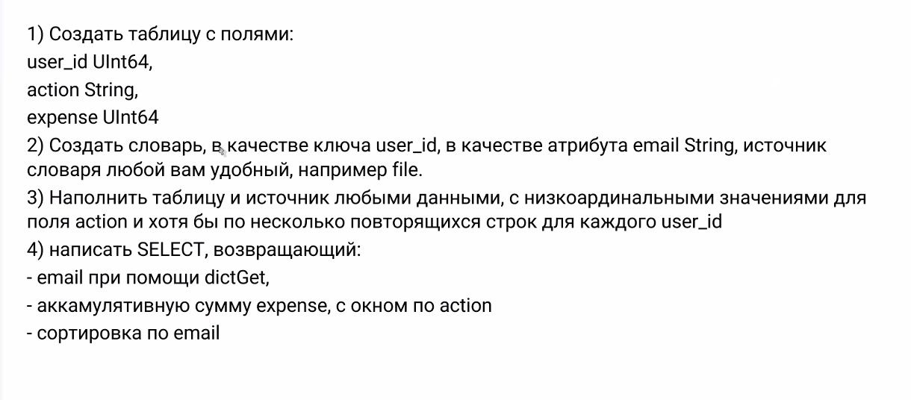
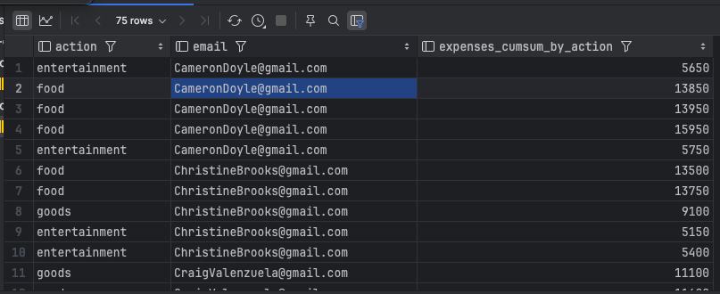

## Домашнее задание #3
## Оконные функции и словари


### Условие дз



##### 1. Создать таблицу с полями 

```sql
CREATE TABLE users_expenses (
    user_id UInt64,
    action String,
    expense UInt64
) ENGINE MergeTree()
PRIMARY KEY (action);
```

##### 2. Создать словарь, в качестве ключа user_id, в качестве атрибута email String, источник словаря file

Сам файл -> [users_id_x_emails.csv](user_files%2Fusers_id_x_emails.csv)

```sql
CREATE DICTIONARY ids_x_emails (
    id UInt64,
    email String
)
PRIMARY KEY id
SOURCE(FILE(path '/var/lib/clickhouse/user_files/users_id_x_emails.csv' format 'CSV'))
LAYOUT ( FLAT() )
LIFETIME ( min 100 max 500 );
```

##### 3. Наполнить таблицу и источник любыми данными:

```sql
INSERT INTO users_expenses VALUES
(0, 'food', 2000),
(0, 'food', 100),
(0, 'entertainment', 2000),
(0, 'entertainment', 100),
(0, 'food', 100),
(1, 'goods', 2000),
(1, 'entertainment', 250),
(1, 'goods', 250),
(1, 'food', 2000),
(1, 'goods', 250),
(2, 'entertainment', 250),
(2, 'entertainment', 250),
(2, 'food', 2000),
(2, 'food', 2000),
(2, 'food', 250),
(3, 'food', 100),
(3, 'food', 250),
(3, 'entertainment', 100),
(3, 'food', 100),
(3, 'goods', 2000),
(4, 'entertainment', 2000),
(4, 'food', 2000),
(4, 'food', 2000),
(4, 'food', 250),
(4, 'entertainment', 100),
(5, 'goods', 2000),
(5, 'goods', 250),
(5, 'food', 100),
(5, 'goods', 250),
(5, 'goods', 100),
(6, 'food', 250),
(6, 'food', 250),
(6, 'goods', 2000),
(6, 'entertainment', 100),
(6, 'entertainment', 250),
(7, 'entertainment', 250),
(7, 'food', 100),
(7, 'entertainment', 100),
(7, 'food', 100),
(7, 'food', 2000),
(8, 'food', 250),
(8, 'goods', 2000),
(8, 'goods', 250),
(8, 'food', 100),
(8, 'goods', 250),
(9, 'goods', 250),
(9, 'goods', 2000),
(9, 'food', 2000),
(9, 'food', 100),
(9, 'food', 250),
(10, 'goods', 250),
(10, 'goods', 250),
(10, 'food', 100),
(10, 'food', 250),
(10, 'goods', 250),
(11, 'goods', 250),
(11, 'food', 100),
(11, 'food', 100),
(11, 'food', 2000),
(11, 'goods', 2000),
(12, 'entertainment', 250),
(12, 'entertainment', 250),
(12, 'food', 2000),
(12, 'goods', 250),
(12, 'goods', 2000),
(13, 'entertainment', 250),
(13, 'food', 250),
(13, 'goods', 100),
(13, 'goods', 2000),
(13, 'goods', 250),
(14, 'goods', 100),
(14, 'goods', 100),
(14, 'food', 2000),
(14, 'food', 100),
(14, 'goods', 2000);
```

##### 4. Написать SELECT, возвращающий, email при помощи dictGet,аккамулятивную сумму expense, с окном по action, сортировка по email
```sql
SELECT
    action,
    dictGet('ids_x_emails', 'email', user_id) as email,
    sum(expense) over (PARTITION BY action ROWS BETWEEN UNBOUNDED PRECEDING AND CURRENT ROW) as expenses_cumsum_by_action
FROM users_expenses
ORDER BY email;
```

Увидел еще модфицированные `dictGet` функции в доке, приятные!
- https://clickhouse.com/docs/en/sql-reference/functions/ext-dict-functions#dictGet    

- https://clickhouse.com/docs/en/sql-reference/functions/ext-dict-functions#other-functions


