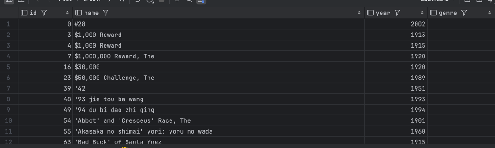
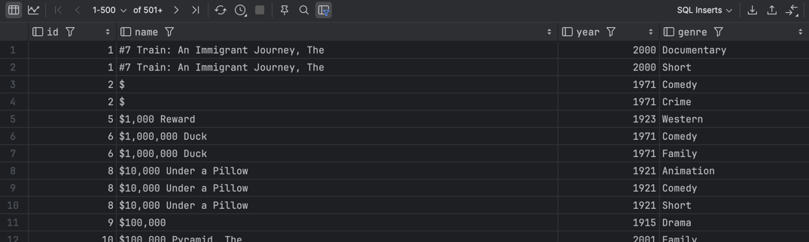
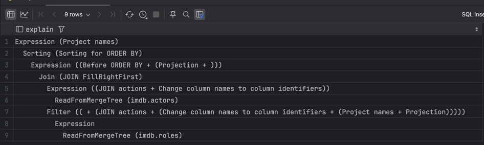

### Домашнее задание 7
#### Условия дз    
https://docs.google.com/document/d/1qIUv3RaRJ60boylxQF2rUdPcqNqAZa8V-yhGVbY6PBM/edit


**Найти жанры для каждого фильма**:

```sql
SELECT m.id,
       m.name,
       m.year,
       g.genre
FROM movies m
INNER JOIN genres g
ON m.id = g.movie_id;
```


--- 

**Запросить все фильмы, у которых нет жанра**
```sql
SELECT m.id,
       m.name,
       m.year,
       g.genre
FROM movies m
LEFT JOIN genres g
ON m.id = g.movie_id
WHERE g.movie_id = 0;
```



**[WARNING]**

А вот тут хочется обратить внимание не некоторый подвох.   
Использование дефолтных значений вместо `NULL` по умолчанию включено в параметре [join_use_nulls](https://clickhouse.com/docs/en/operations/settings/settings#join_use_nulls).      
Кажется, в конкретном кейсе это безопасная история, но если мы сделаем:
```sql
INSERT INTO genres VALUES (0, 'VERY SPECIFIC GENRE');
```

То результат предыдущго запроса будет следующим:    


Есть подводные, c дества за `ANTI JOIN` на самом деле.   

-----

**Объединить каждую строку из таблицы “Фильмы” с каждой строкой из таблицы “Жанры”**
```sql
SELECT *
FROM movies
CROSS JOIN genres;
```
Запускать не буду от греха подальше.   


---- 

**Найти жанры для каждого фильма, НЕ используя INNER JOIN**
```sql
SELECT m.id,
       m.name,
       m.year,
       g.genre
FROM movies m
LEFT JOIN genres g
ON m.id = g.movie_id
WHERE genre != ''
ORDER BY id;
```




----


**Найти всех актеров и актрис, снявшихся в фильме в 2023 году**   
Плохие новости, данных за 2023 год в датасете не существует
```sql
SELECT COUNT(1) as cnt FROM roles WHERE toYear(roles.created_at) == '2023';
```


Хорошие новости - я могу поменять год на `2024` =)

Если бы я хотел найти **все роли всех актеров** из `2024`, то использовал бы `INNER JOIN`, если нужен просто список актеров, то можно через `SEMI JOIN`.   
Подзапрос добавил в надежде дать меньше данных в сам джоин, и увидел в `EXPLAIN` варианта с подзапросом слово `FILTER`, возможно это к лучшему! 

```sql
SELECT
    a.first_name,
    a.last_name
FROM actors AS a
LEFT SEMI JOIN (SELECT * FROM roles WHERE toYear(created_at) == '2024') AS r
    ON a.id = r.actor_id
WHERE toYear(created_at) = '2024'
ORDER BY id ASC;
```


**EXPLAIN варианта с подзапросом:**




**EXPLAIN варианта просто с roles:**


----


**Запросить все фильмы, у которых нет жанра, через ANTI JOIN**

```sql
SELECT m.id,
       m.name,
       m.year,
       genre
FROM movies m
LEFT ANTI JOIN genres g
ON m.id = g.movie_id
ORDER BY id;
```


