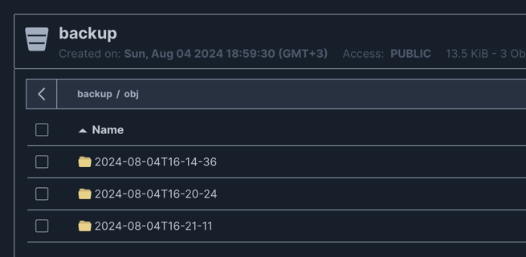

## Storage policy и резервное копирование

### 1.Развернуть S3 на базе open-source MinIO/Ceph или воспользуйтесь Object Storage от Yandex Cloud
Развернул minio в докере прям вот тут -> [docker-compose.yaml](docker-compose.yaml)
```yaml
  minio:
    image: 'bitnami/minio:latest'
    ports:
      - '9000:9000'
      - '9001:9001'
    environment:
      - MINIO_ROOT_USER=minio-root-user
      - MINIO_ROOT_PASSWORD=minio-root-password
      - MINIO_SERVER_ACCESS_KEY=minio-access-key
      - MINIO_SERVER_SECRET_KEY=minio-secret-key
      - MINIO_DEFAULT_BUCKETS=backup-bucket
```
### 2.Установить clickhouse-backup и выполнить настройки storage policy в конфигурационных файлах БД
Взял последний релиз для [clickhouse-backup](clickhouse-backup) из https://github.com/Altinity/clickhouse-backup.    
Так же создат отдельный файл конфигурации для настройки -> [storage.xml](clickhouse%2Fconfig%2Fstorage.xml)
### 3.Создать тестовую БД, в ней несколько тестовых таблиц и наполнить их данными
```sql
-- Создаем табличку
CREATE TABLE test(
    id UInt32,
    val Nullable(String)
) ENGINE MergeTree()
order by id;

-- Наполняем ее данными
INSERT INTO test
SELECT number as id, 'value' as val FROM numbers(1000);

-- Проверяем наполнение
SELECT * FROM test LIMIT 2;
+--+-----+
|id|val  |
+--+-----+
|0 |value|
|1 |value|
+--+-----+
```
### 4.Произвести бекапирование на удаленный ресурс (s3)
С настроенныем конфигом для утилиты выполнил команду:
```shell
./clickhouse-backup --config ./config.yaml create_remote
```

Получил бекапы в Minio:   


### 5."Испортить" данные в текущем инстансе ClickHouse - удалить таблицу, изменить строку и пр.
```sql
-- Меняем табличку 
ALTER TABLE test UPDATE val = 'wrong_value' WHERE 1;

-- Посмотрим поменялось ли значение
SELECT * FROM test LIMIT 2;
+--+-----------+
|id|val        |
+--+-----------+
|0 |wrong_value|
|1 |wrong_value|
+--+-----------+

```
### 6.Произвести восстановление из резервной копии
```shell
./clickhouse-backup --config ./config.yaml restore_remote 2024-08-04T16-30-20
```
### 7.Убедиться, что "испорченные" данные успешно восстановлены
```sql
-- Проверяем, восстановили ли мы значение
SELECT * FROM test LIMIT 2;
+--+-----+
|id|val  |
+--+-----+
|0 |value|
|1 |value|
+--+-----+

```