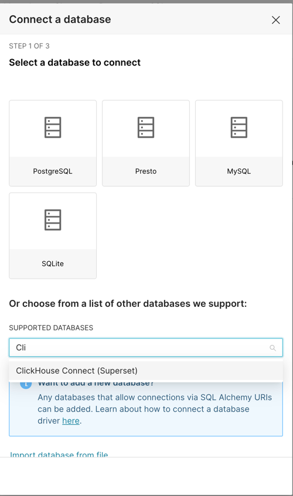
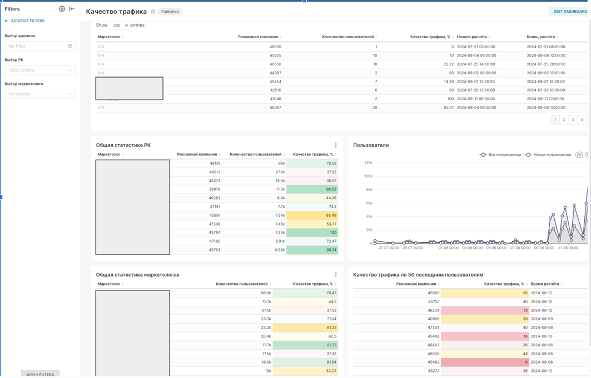
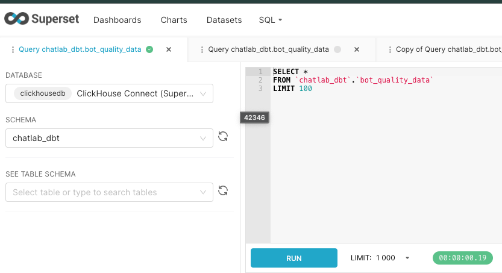

### Интеграция с BI решениями
### 1.Развернуть и cконфигурировать BI-решение;
Использовал [helm chart для Superset](https://github.com/apache/superset/blob/master/helm/superset/Chart.yaml).
### 2.Настроить подключение к источникам данных;
Добавим `clickhouse-connect` для установки необходимых зависимостей для интеграции с `clickhouse`
```yaml
# -- Install additional packages and do any other bootstrap configuration in this script
# For production clusters it's recommended to build own image with this step done in CI
# @default -- see `values.yaml`
bootstrapScript: |
  #!/bin/bash
  pip install clickhouse-connect==0.7.16
  if [ ! -f ~/bootstrap ]; then echo "Running Superset with uid {{ .Values.runAsUser }}" > ~/bootstrap; fi
```

Теперь можем выбрать clickhouse в списке доступных баз данных    

### 3.Рассмотреть интерактивный визуальный анализ данных.
### Построить дашборд с 5 различными визуализациями на основе данных в БД ClickHouse.


И теперь можем использовать интеграцию c Clickhouse в том числе и в sql-lab суперсета.
