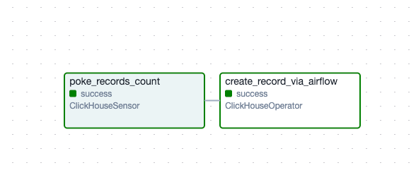
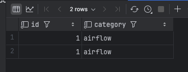

### Оркестраторы DI / Tools

### 1.Развернуть инструмент для переливки данных
Собрал свой [контейнер](dev/Containerfile) для airflow, указав в [зависимостях](dev/requirements.txt) [плагин](https://github.com/bryzgaloff/airflow-clickhouse-plugin) для клика.
Поднял Airflow в куберах используя этот образ:
```yaml
# Images
images:
  airflow:
    repository: cr.monowork.tech/analytics/airflow-dev # контейнер из файла сверху
    tag: 2.2.0-airflowdev
    pullPolicy: IfNotPresent
```
Раскрутил хелм чарт, чтобы было.    
```shell
helm upgrade airflow-dev ./airflow --namespace df-airflow-dev -f ./airflow/values-dev.yaml
```

### 2.Развернуть ClickHouse
Взял уже рабочий инстанс.

### 3.Выбрать любой источник (API, сервис, БД и пр.)
Для простоты взял тот же Clickhouse из предыдущего пункта =)

### 4.Настроить подключение инструмента к ClickHouse   
Настроил подключение к клику из Airflow вот [таким образом](https://github.com/bryzgaloff/airflow-clickhouse-plugin?tab=readme-ov-file#how-to-create-an-airflow-connection-to-clickhouse):

### 5.Построить пайплайн для регулярной/разовой переливки данных в ClickHouse 
[airflow-clickhouse-dag-example.py](airflow-clickhouse-dag-example.py)

### 6.Отобразить успешный запуск пайплайна/дага и наличие информации в БД-приемнике     



```sql
SELECT * FROM analytics_sandbox.airflow_integration_example;
```

