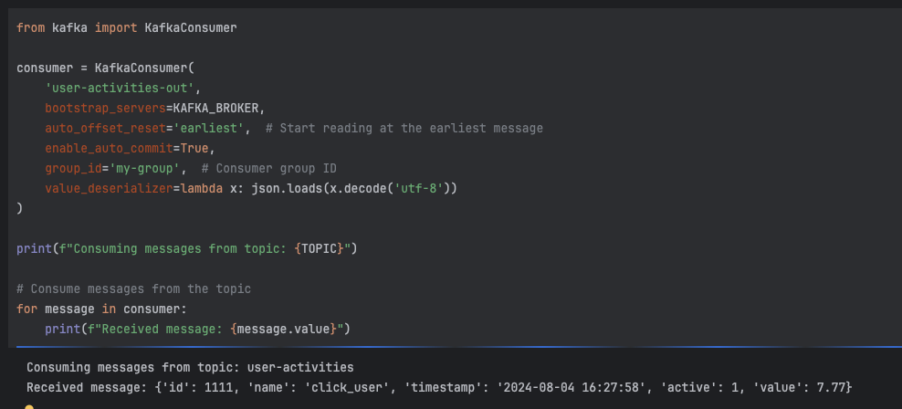

# Интеграция с Kafka
## Толковвые визуализации вот тут 
https://clickhouse.com/docs/en/integrations/kafka/kafka-table-engine

### 1.Установить кафку любым удобным способом
### 2.Установить ClickHouse, произвести необходимые настройки

Развернул с помощью вот этого [docker-compose.yaml](devops%2Fdocker-compose.yaml)

### 3.Записать данные в кафку, построить пайплайн чтения через kafka engine -> mv to mergetree.  Убедиться в верном прочтении данных
```sql
-- Создаем целевую табличку
CREATE TABLE user_activities_msg (
    id Int32,
    name String,
    timestamp DateTime,
    active UInt8,
    value Float32,
    kfk_topic String,
    kfk_partition UInt64,
    kfk_timestamp Nullable(DateTime),
    kfk_raw_message Nullable(String),
    kfk_error Nullable(String)
) ENGINE = MergeTree()
ORDER BY id;


-- Создаем Kafka Engine
CREATE TABLE user_activities_queue (
    id Int32,
    name String,
    timestamp DateTime,
    active UInt8,
    value Float32
) ENGINE = Kafka('kafka:9092', 'user-activities', 'consumer-group', 'JSONEachRow')
SETTINGS kafka_handle_error_mode ='stream'; # Упрощаем себе дебаг

-- Создаем материализованное представление
CREATE MATERIALIZED VIEW user_activities_mv TO user_activities_msg AS
--        Вынимаем так же виртуальные колонки со служебными полями с помощь _ префикса
    SELECT *, _topic as kfk_topic,
           _partition as kfk_partition,
           _timestamp as kfk_timestamp,
           _raw_message as kfk_raw_message,
           _error as kfk_error
        FROM user_activities_queue;
```

Отправляем с помощью продюссер обьявленного в [kfk-manipulator.ipynb](kfk-manipulator.ipynb) несколько сообщений.

```sql
-- Получаем сообщения из топика кафки
SELECT * FROM user_activities_msg;

-- Получили одно живое сообщение и два сообщения об ошибке, благодаря  kafka_handle_error_mode ='stream'

+----+----------+-------------------+------+-----+---------------+-------------+-------------------+---------------------------------------------------------------------------------------------------------+---------------------------------------------------------------------------------------------------------------------------------------------+
|id  |name      |timestamp          |active|value|kfk_topic      |kfk_partition|kfk_timestamp      |kfk_raw_message                                                                                          |kfk_error                                                                                                                                    |
+----+----------+-------------------+------+-----+---------------+-------------+-------------------+---------------------------------------------------------------------------------------------------------+---------------------------------------------------------------------------------------------------------------------------------------------+
|840 |user_22   |2024-08-04 16:27:58|1     |17.04|user-activities|2            |2024-08-04 13:27:58|                                                                                                         |                                                                                                                                             |
|0   |          |1970-01-01 00:00:00|0     |0    |user-activities|2            |2024-08-04 13:25:20|{"id": 782, "name": "user_93", "timestamp": "2024-08-04T16:25:20.344013", "active": false, "value": 8.27}|Cannot parse input: expected '"' before: '.344013", "active": false, "value": 8.27}': (while reading the value of key timestamp): (at row 1) |
|0   |          |1970-01-01 00:00:00|0     |0    |user-activities|2            |2024-08-04 13:26:02|{"id": 813, "name": "user_56", "timestamp": "2024-08-04T16:26:02.559217", "active": true, "value": 11.69}|Cannot parse input: expected '"' before: '.559217", "active": true, "value": 11.69}': (while reading the value of key timestamp): (at row 1) |
+----+----------+-------------------+------+-----+---------------+-------------+-------------------+---------------------------------------------------------------------------------------------------------+---------------------------------------------------------------------------------------------------------------------------------------------+

```

### 5.Записать данные в кафку с помощью ClickHouse Kafka Engine
```sql
-- Создаем еще один kafka engine нацеливая его на другой топик
CREATE TABLE user_activities_queue_out (
    id Int32,
    name String,
    timestamp DateTime,
    active UInt8,
    value Float32
) ENGINE = Kafka('kafka:9092', 'user-activities-out', 'consumer-group-out', 'JSONEachRow')
SETTINGS kafka_handle_error_mode ='stream';;

-- Создаем вьюху сверху нашей MergeTree таблицы для обработки инсертов в нее
CREATE MATERIALIZED VIEW github_out_mv TO user_activities_queue_out AS
SELECT id, name, timestamp, active, value
FROM user_activities_msg;

-- Делаем инсерт
INSERT INTO user_activities_msg VALUES (1111, 'click_user', '2024-08-04 16:27:58', True, 7.77, 'test', -1, NULL, NULL, NULL);

```

Смотрим в вывод нашего консюмера в [kfk-manipulator.ipynb](kfk-manipulator.ipynb)
