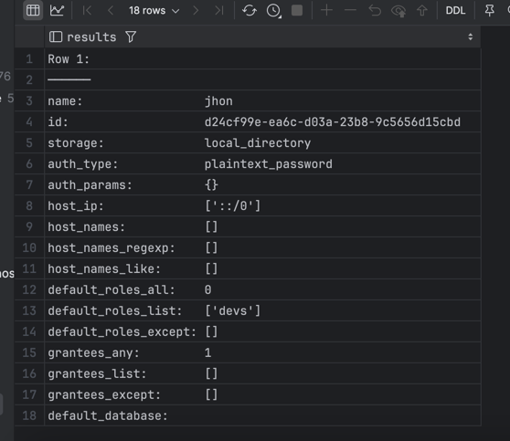
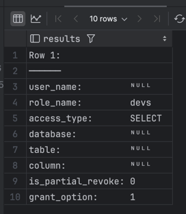
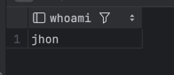
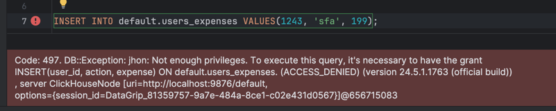
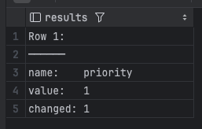
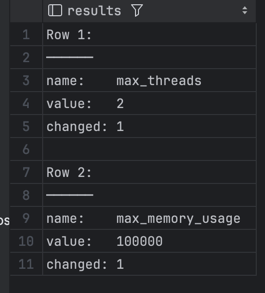

### Домашнее задание по RBAC
#### RBAC


#### Версия из презентации
**1) Создать пользователя `jhon` с паролем `qwery`**
```sql
-- Создаем пользователя Jhon, в этот раз просто plaintext
CREATE USER jhon IDENTIFIED WITH plaintext_password BY 'qwery';
```

**2) Создать роль `devs`**
```sql
-- Создаем роль devs
CREATE ROLE devs;
```

**3) Выдать роли `devs` права на `SELECT` на любую таблицу**
```sql
-- Дадим права на чтение на любую таблицу в базе данных default
GRANT SELECT ON *.* TO devs WITH GRANT OPTION;
```

**4) Выдать роль `devs` пользователю `jhon`**
```sql
-- Присвоим роль пользователю jhon, делаем дефолтной при каждом логине
GRANT devs to jhon;
SET DEFAULT ROLE devs TO jhon;
```


**5) предоставить результаты `SELECT` из system-таблиц соответсвующих созданным сущностям**

```sql
-- Проверим, как там наш новый "jhon", ох уж эта опечатка канеш в имени, приходится жмурится.
SELECT * FROM system.users WHERE name = 'jhon' FORMAT Vertical
```



```sql
-- Посмотрим на созданную роль
SELECT * FROM system.roles WHERE name = 'devs' FORMAT Vertical
```


```sql
-- Проверим какие гранты есть у роли
SELECT * FROM system.grants WHERE role_name = 'devs' FORMAT Vertical;
```



**P.S, проверил подключившися как `jhon`, `SELECT` отработал отлично:**
```sql
SELECT currentUser() as whoami;
```


```sql
-- Делаем селект от имени jhon
SELECT * FROM default.users_expenses FORMAT Vertical;
```


```sql
-- Пробуем вставить значения
INSERT INTO default.users_expenses VALUES(1243, 'sfa', 199);
```


#### Версия с сайта


**Создать пользователя priviliged, приоритизировать его запросы;**
```sql
-- Создаем привилегированного пользователя
CREATE USER privileged;
ALTER USER privileged SETTINGS priority = 1;
```

```sql
-- Проверим его настройки
SELECT name, value, changed FROM system.settings WHERE name in ('priority') FORMAT Vertical;
```


**Создать пользователя limited, ограничить выделяемые ему ресурсы;**
```sql
-- Создание и ограничение пользователе limited
CREATE USER limited;
ALTER USER limited SETTINGS max_threads = 2, max_memory_usage = 100000;
```

```sql
-- Проверим от лица limited
SELECT name, value, changed FROM system.settings WHERE name in ('max_threads', 'max_memory_usage') FORMAT Vertical;
```


