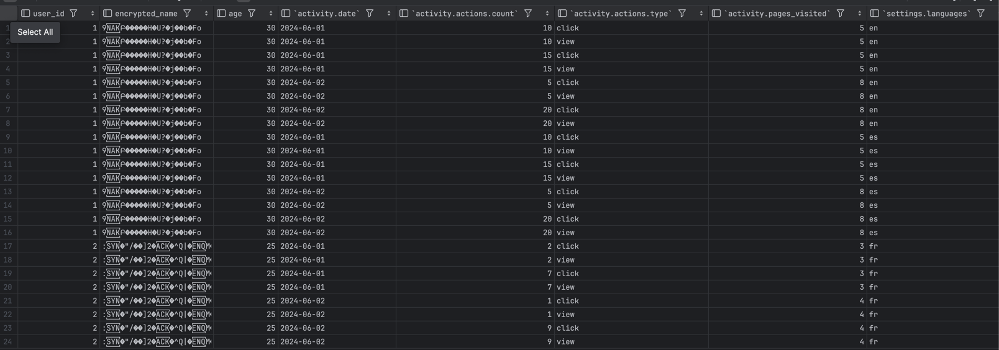

## Домашнее задание #4
### Условие
Собираюсь развернуть его в "плоский вид", нарисовать одну UDF функцию, чтобы посчитать абстрактную активность пользователя, в рамках которой события `click` будут давать `N` очков, а `view` `M`.

JSON над которым производятся манипуляции - [complicated_json_to_handle.json](examples/complicated_json_to_handle.json)    
    
```sql
-- Посмотрим, что нас ожидает
DESCRIBE file('/var/lib/clickhouse/user_files/complicated_json_to_handle.json');
```


```sql
-- Создадим табличку из json доверясь интроспекции схемы со стороны Clickhouse
CREATE TABLE user_activity_table ENGINE File(JSON, '/var/lib/clickhouse/user_files/complicated_json_to_handle.json');
-- Проверим получившуюся DDL
SHOW CREATE TABLE user_activity_table;
```


```sql
-- Создадим табличку с соответствиями типов событий к очкам активности
CREATE TABLE event_x_score (
    event_type String,
    score Nullable(UInt64)
) ENGINE MergeTree()
PRIMARY KEY event_type;

-- Вставим значения
INSERT INTO event_x_score VALUES ('click', 11), ('view', 5);


-- Создадим словарь, к которому сможем обращаться в дальнейшем
CREATE DICTIONARY event_x_score_dict (
    event_type String,
    score Nullable(UInt64)
) PRIMARY KEY event_type
SOURCE ( CLICKHOUSE(password 'default' db 'default' table 'event_x_score') )
-- Для ключа стринг можем взять не много не мало COMPLEX_KEY_CACHED()
LAYOUT ( COMPLEX_KEY_HASHED() )
LIFETIME ( min 0 max 100 );

-- Создадим функцию для подсчета очков активности
CREATE FUNCTION calculate_activity_score as (event_type, event_cnt) -> event_cnt*dictGet('event_x_score_dict', 'score', event_type);

-- Переведем наш json в плоский вид, используем подготовленную udf функцию
SELECT *,
       calculate_activity_score("activity.actions.type", "activity.actions.count") as activity_score
       FROM (
                  SELECT user_id,
--     Зашифруем имя, будем считать что охраняем PIL
                         encrypt('aes-256-gcm', name, 'keykeykeykeykeykeykeykeykeykey01', 'iv1') as encrypted_name,
                         age,
                         activity.date                                                           as "activity.date",
--     По привычке искал explode честно говоря
                         arrayJoin(activity.actions.count)                                       as "activity.actions.count",
                         arrayJoin(activity.actions.type)                                        as "activity.actions.type",
                         activity.pages_visited                                                  as "activity.pages_visited",
                         arrayJoin(tupleElement(settings, 'languages'))                          as "settings.languages",
--     Это что, именнованые тюплы? Приятно!
                         tupleElement(settings, 'notifications')                                 as "settings.notifications",
                         tupleElement(settings, 'theme')                                         as "settings.theme"
                  FROM user_activity_table
                           ARRAY JOIN activity
           );
```


Полный результат можно посмотреть вот тут [flatified_json_with_udf_func.csv](output/flatified_json_with_udf_func.csv).   
Дополнительно ознакомился c:

- https://clickhouse.com/docs/en/sql-reference/functions/udf#executable-user-defined-functions    
Прикольно, использовал бы для имплементации функции распознавание полов ( gender ) по имени, как раз удобно сделать ее в Python.    
- https://clickhouse.com/docs/ru/sql-reference/functions/json-functions
- https://clickhouse.com/docs/ru/sql-reference/functions/nlp-functions    
Сюда просто из любопытства зашел.    
```sql
SET allow_experimental_nlp_functions=1;
SELECT stem('ru', 'волка'), stem('ru', 'волки'), stem('ru', 'волку');
```


